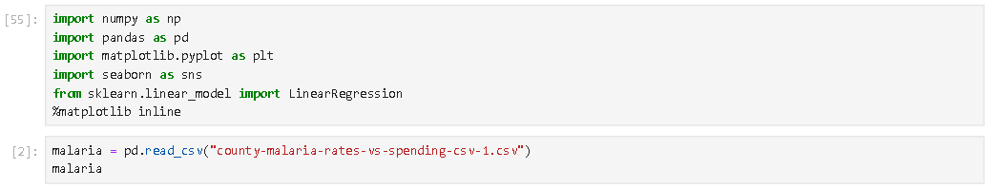
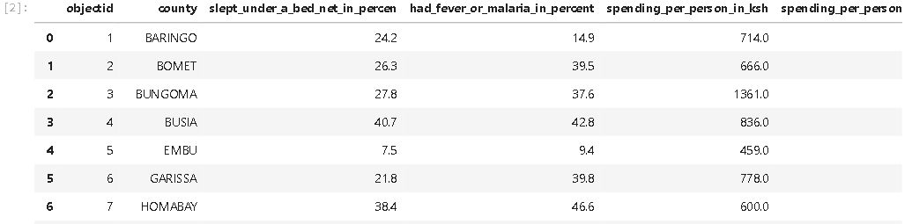
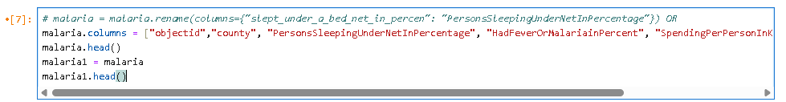
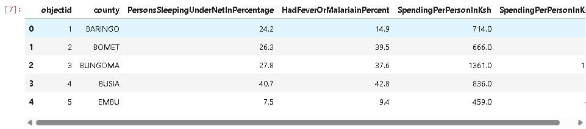

# Analysis of Malaria Data from Kenya
## EDA WITH PYTHON

# Table of Content
- [Code blocks](#code_blocks)
- [Data](#data)
  
## In analyzing malaria data across counties, I explored how prevention and spending interact:
The variables of interest were county (Counties in Kenya), slept under a bed net (%), had fever (%)(suspected malaria) and spending per person (Ksh - Kenyan Shillings)
Counties with higher fever rates often had higher reported bed net use. This may seem counterintuitive - but likely reflects that bed nets are distributed most aggressively in malaria hotspots. 
Spending per person was uneven across counties. Interestingly, in counties with higher health spending, fever prevalence tended to be lower, suggesting an equity gap.
Some counties show high bed net coverage but still high fever rates – pointing to possible issues like net misuse, insecticide resistance, or gaps in other interventions
Higher spending per person often correlated with lower fever prevalence.
But some counties with high bed net use still showed high fever rates – raising questions about insecticide resistance, usage patterns, or other prevention gaps.
Data like this shows malaria control isn’t just about distributing nets – it’s about ensuring resources translate into real impact. 
Would love to hear from public health professionals: How can we use these insights to ensure prevention spending matches malaria burden?
#DataScience #Epidemiology #Malaria #Python #PublicHealth

# code_blocks

# data

### 

## thank you

## Subheader
